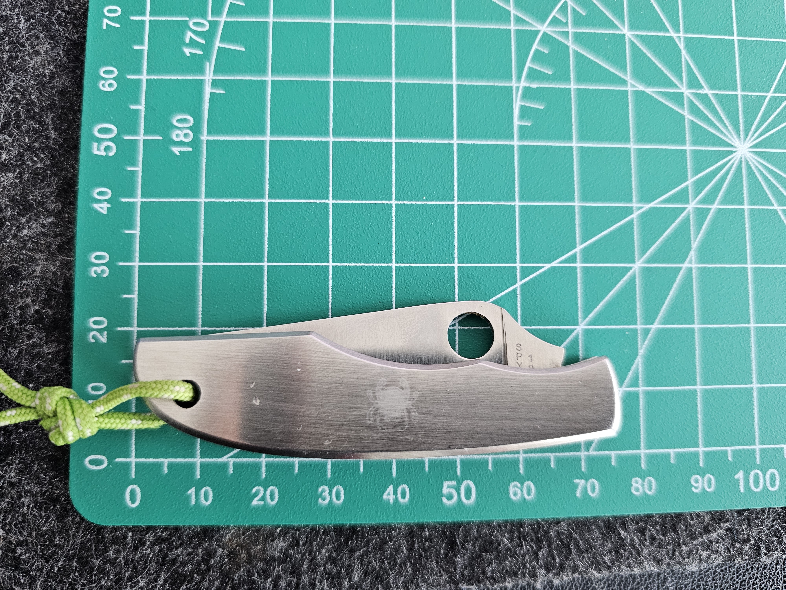
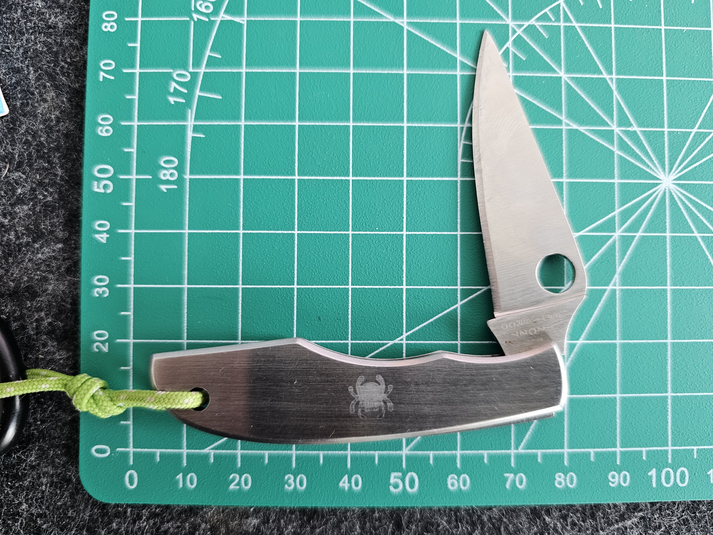
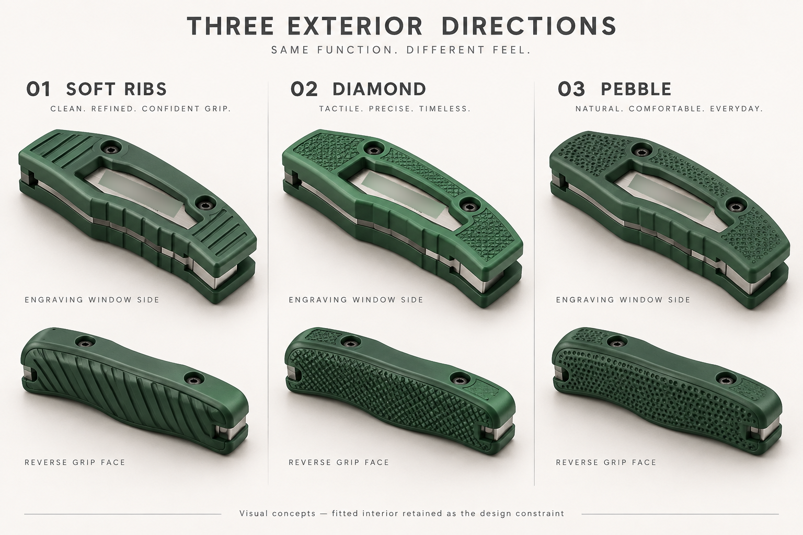
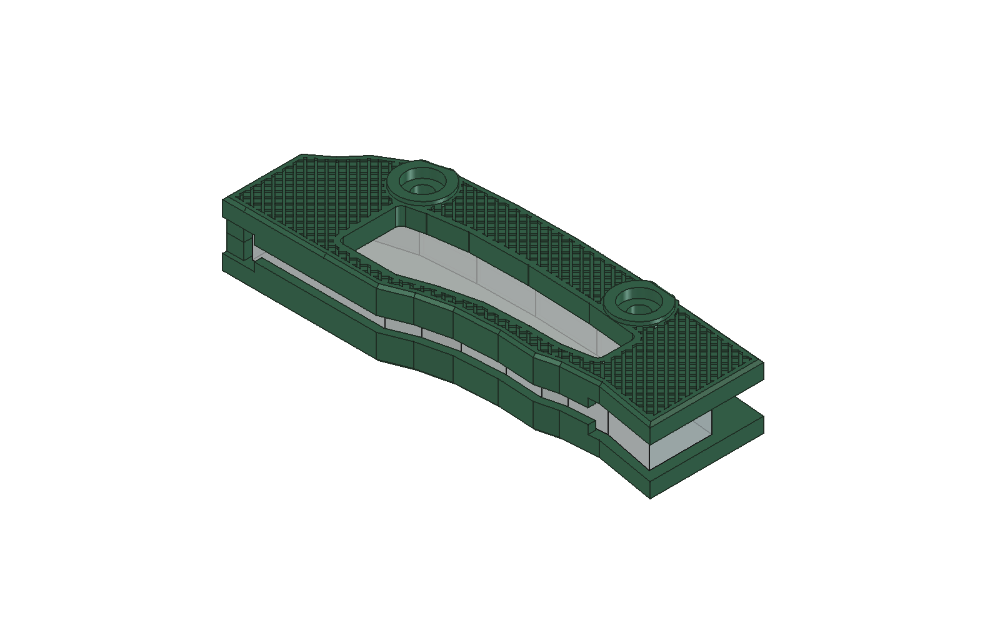
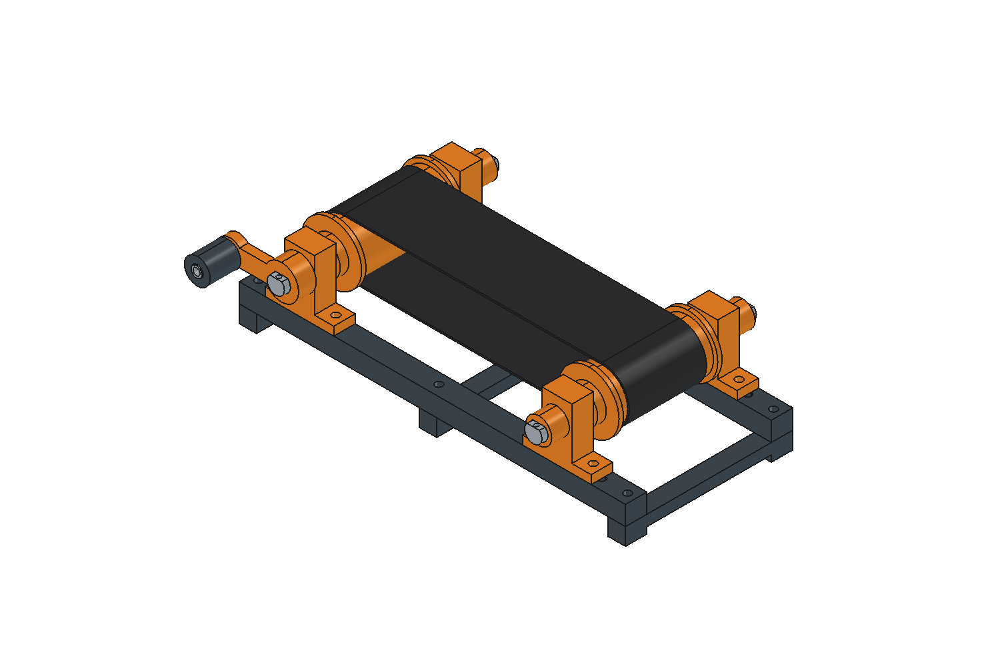
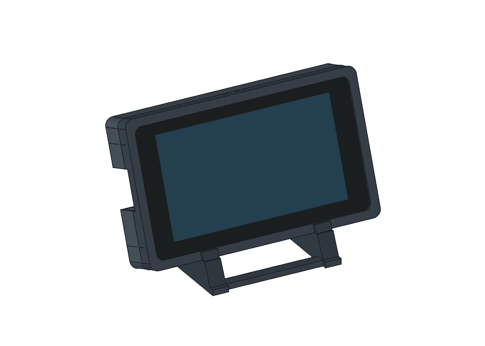
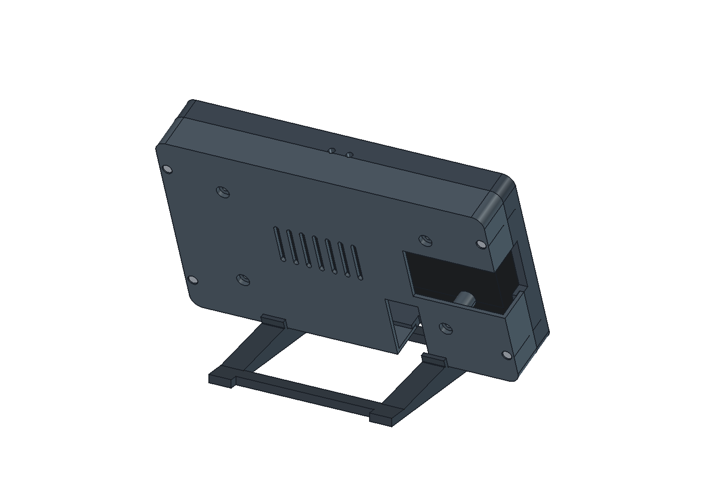

# FreeCAD Designer

A Codex skill for creating, inspecting, modifying, and exporting CAD models through FreeCAD MCP.

Use it for new designs or changes to existing projects: parametric parts, imported geometry, sketches, surfaces, assemblies, technical drawings, and preparation for manufacturing or visualization. It adapts the workflow and checks to the request rather than treating every project as a 3D print.

## Featured project: fitted pocketknife grip

Our main worked example follows a real object from reference photos and measurements through a printed fit test, exterior concepts, and a revised FreeCAD model.

| Closed | Open |
| --- | --- |
|  |  |

*Starting point: user-supplied photographs of the existing knife. The full example includes the measurements and prototype feedback.*



*AI-generated design exploration: soft ribs, diamond, and pebble. Option 02, diamond, was selected; this illustration is a visual target, not a CAD result.*



*Implemented result: the V04 FreeCAD model with broad diamond coverage and a window over the inscription.*

The removable, screw-fastened grip was developed through trial prints. **V02's fit was physically confirmed.** Later revisions slimmed the exterior and expanded the texture while preserving the fitted interior and fastener seats in CAD. **V04 has not been physically tested.**

[Explore the complete knife project →](examples/pocketknife-grip/README.md)

The example includes reference images, the supplied concept-selection screenshot, the confirmed baseline, final FCStd/STL files, a rebuild macro, and verification records. It demonstrates retention checks, preserving successful fit, matching texture coverage, and reassessing print orientation after cosmetic changes.

## More projects

Actual FreeCAD previews from the projects that informed this skill's workflow. These projects were created through FreeCAD MCP before the workflow was packaged as a reusable skill. The images show CAD models, not photographs of manufactured parts.

### Hand-cranked miniature conveyor



A small conveyor designed around PLA components and a TPU belt, with repeated linked parts, printable D-shafts, and an adjustable rear roller. The workflow included solid and mesh checks plus collision checks at sampled crank positions.

### Desktop display enclosure

| Front | Rear |
| --- | --- |
|  |  |

A desktop enclosure for a Waveshare 7-inch display, designed around supplied component geometry. The project evolved from a clip closure to a screw-fastened enclosure with a removable stand, connector access, and ventilation.

### Shelf lighting system and clamp revision


A modular LED-strip holder for indirect shelf lighting, including rails, a corner connection, and shelf attachment. The assembly preview shows the system concept; the detail below shows the subsequent clamp revision.

<details>
<summary>View the revised captive-nut pocket</summary>


The nut pocket was moved to the upper side of the lower clamp arm. A retaining shoulder below the nut carries the reaction force from the screw entering from underneath. This illustrates revising an existing model in response to a mechanical design issue.

</details>

## Requirements

- Codex with local skill support.
- FreeCAD and a working FreeCAD MCP connection configured in Codex.
- Tools for inspecting and editing documents; Python execution is useful for advanced workflows.

This repository contains skill instructions, not FreeCAD, a workbench, or an MCP server. Available operations depend on your installed workbenches and MCP tools. The skill checks those capabilities instead of promising unsupported operations.

## Set up FreeCAD MCP

Install [FreeCAD](https://www.freecad.org/downloads.php) and [uv](https://docs.astral.sh/uv/getting-started/installation/). Install the `addon/FreeCADMCP` folder from [neka-nat/freecad-mcp](https://github.com/neka-nat/freecad-mcp) into FreeCAD's user `Mod` directory, restart FreeCAD, select **MCP Addon**, and click **Start RPC Server**.

Register the bridge with Codex:

```sh
codex mcp add freecad -- uvx freecad-mcp
```

Keep FreeCAD open and ask Codex to list its documents to verify the connection. Follow the [complete setup guide](docs/freecad-mcp-setup.md) for the correct addon path, manual TOML configuration, source-checkout setup, and troubleshooting. Installing the skill alone does not establish this connection.

## Install

Ask Codex:

```text
Use $skill-installer to install https://github.com/mattz1337/freecad-designer
```

Alternatively, copy the repository into a `freecad-designer` folder in your Codex personal skills directory. Keep `SKILL.md`, `agents/`, and `references/` together. If it does not appear after installation, restart Codex.

## Example prompts

```text
Use $freecad-designer to inspect my existing FreeCAD model, increase the
mounting-hole spacing to 60 mm, and check the dependent features.
```

```text
Use $freecad-designer to design an enclosure around this STEP model,
with an editable wall thickness and a dimensioned technical drawing.
```

```text
Use $freecad-designer to build a hand-cranked miniature conveyor using
PLA and TPU, with repeated components and checked motion positions.
```

```text
Use $freecad-designer to inspect this imported surface model, explain
the open boundaries, and repair the geometry where practical.
```

## Workflow

The skill clarifies important constraints, inspects existing geometry before editing, chooses suitable modeling tools, preserves useful feature history, and checks the actual result in FreeCAD. It provides the files the task needs: an updated FCStd, exports, drawings, source macros, or assembly guidance as appropriate.

It distinguishes native parametric models from script-generated shapes, direct editing from recovered feature history, and pose previews from solved mechanisms. Geometry checks do not establish physical strength, print fit, manufacturing feasibility, or real-world performance by themselves.

## Contents

- `SKILL.md`: general CAD workflow, including existing-model revisions.
- `references/freecad-workflow.md`: execution, linked parts, motion, and verification details.
- `references/manufacturing.md`: optional functional and manufacturing guidance.
- `references/fitted-revisions.md`: measured fit, prototype feedback, protected interfaces, and texture coverage.
- `docs/freecad-mcp-setup.md`: addon and Codex bridge setup.
- `examples/pocketknife-grip/`: documented project with CAD, print files, source, and images.
- `agents/openai.yaml`: Codex skill metadata.

See the [official skill documentation](https://learn.chatgpt.com/docs/build-skills) for discovery and configuration.
