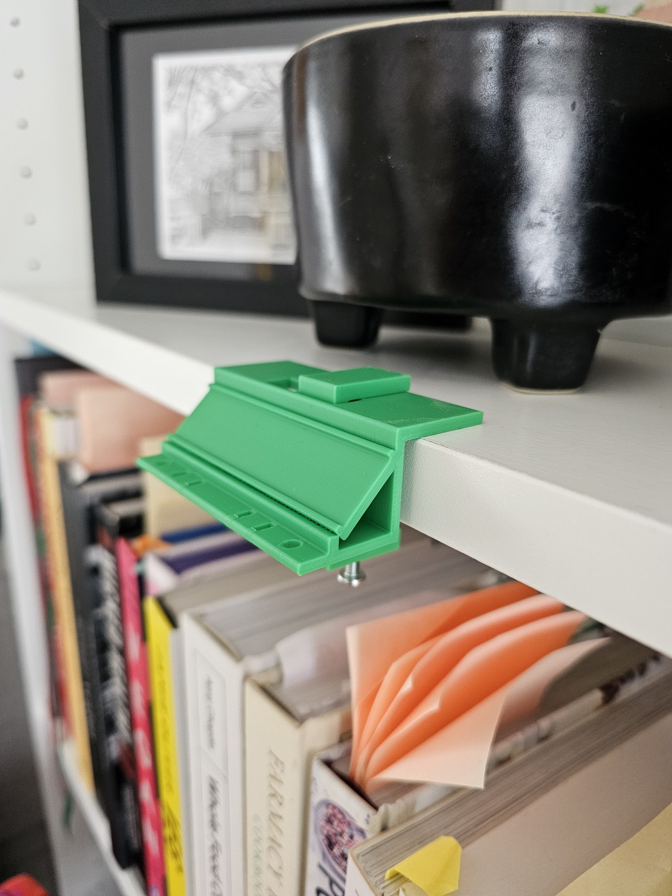
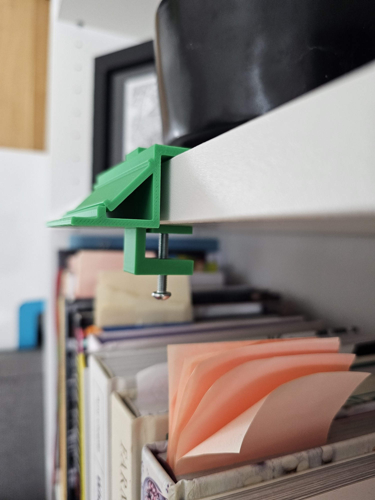
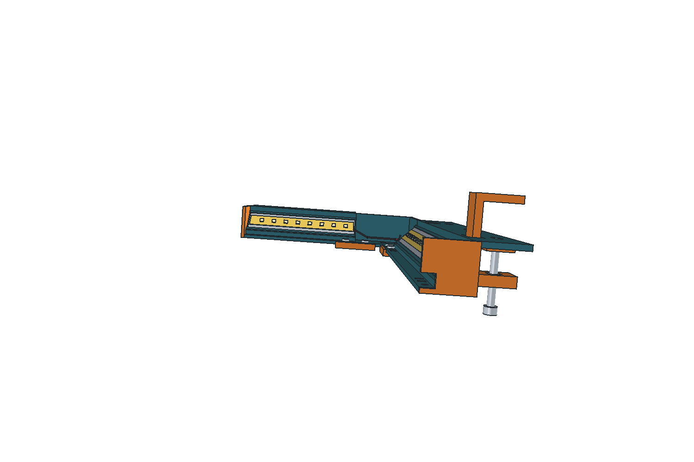
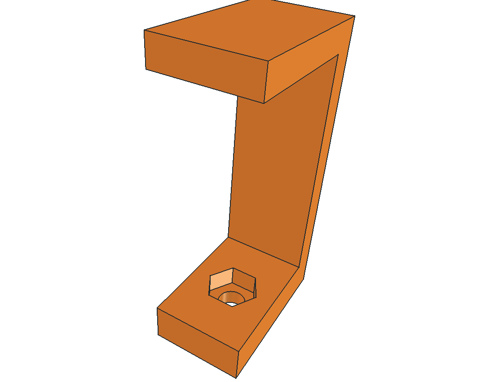

# Shelf-lighting rail and clamp

The modular rail holds an LED strip for indirect shelf lighting. Its printed attachment grips a shelf edge with a screw clamp. The CAD view documents the rail, corner, and clamp concept; the user-supplied photographs show a green printed attachment mounted on a shelf.

| Mounted print | Clamp detail |
| --- | --- |
|  |  |

The photos establish that a clamp and rail were printed and placed on a shelf. They are stored upright in portrait orientation with the camera's EXIF rotation applied to the pixels and source metadata removed, so the views render consistently in the README and on GitHub. They do not establish the LED strip's electrical installation, long-term load capacity, or the exact CAD revision used for the print.

## CAD design and revision

The initial design combined modular rail sections, a corner connection, and a screw-on shelf attachment. A later clamp revision moved the hexagonal nut pocket to the upper side of the lower clamp arm so a solid shoulder carries the screw's reaction force.

The CAD previews show design intent; the new photographs show the printed object. This repository currently documents the project with images rather than shipping its FCStd or STL files. For a similar clamp, measure the actual shelf thickness and hardware, check screw access and nut retention, and verify the printed fit on the intended shelf.
