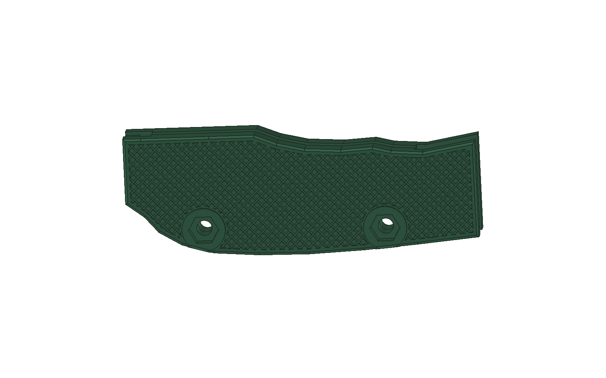
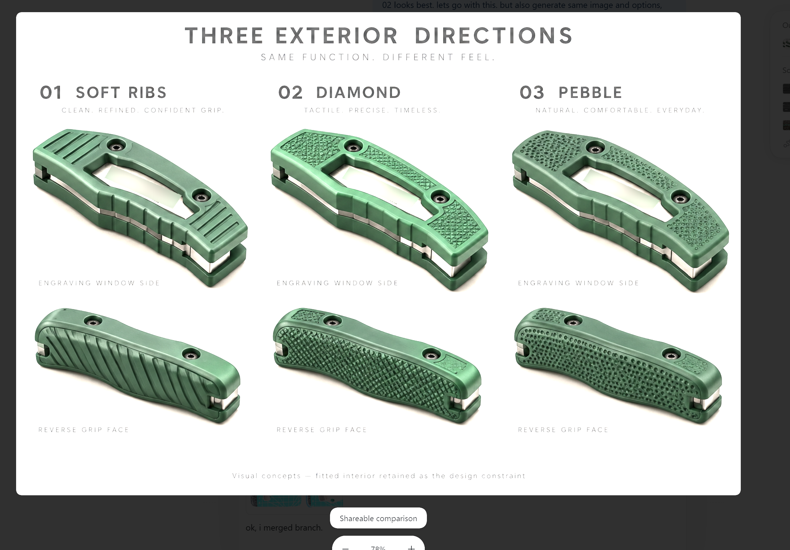
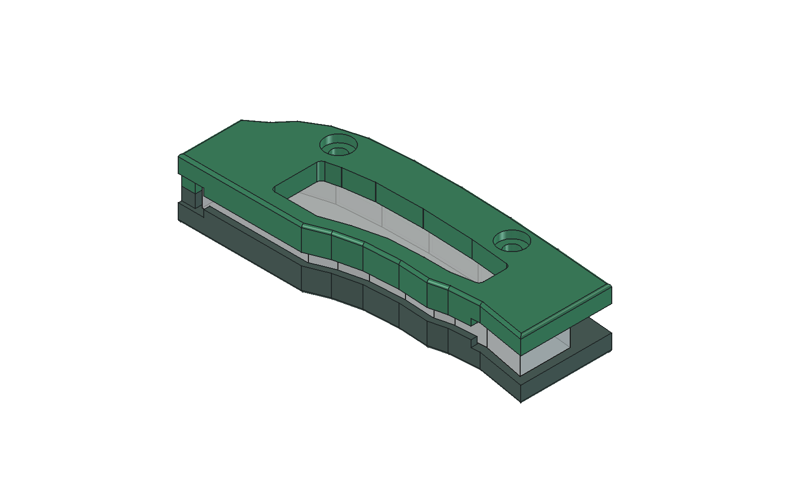
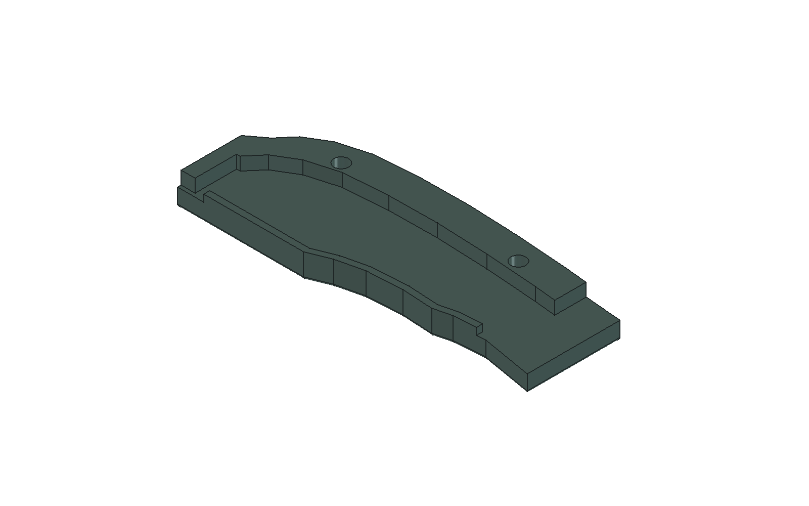
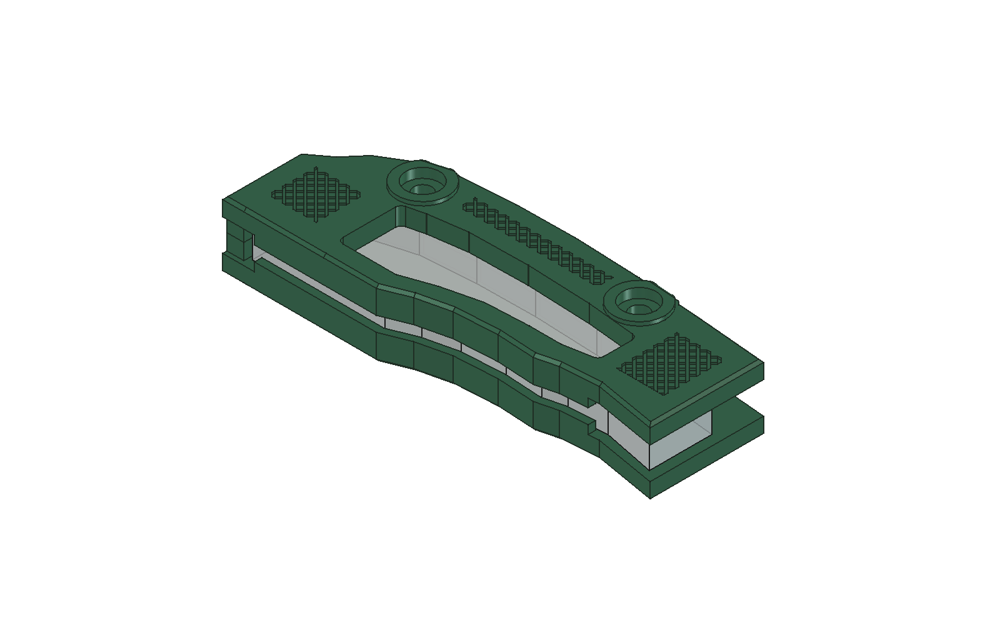

# Fitted pocketknife grip: from prototype to diamond texture

A removable two-piece grip for an existing folding pocketknife, fastened with screws along an external spine. The design enlarges the grip, preserves access for folding, and includes a window over an inscription. All dimensions are in millimeters. This is a specific fitted example, not a universal knife accessory.

**Evidence:** the user physically printed and confirmed the fit of **V02**. **V04** preserves selected functional regions in CAD and passed the recorded geometry/mesh checks; it has not been physically print-tested. Blade motion was not simulated because a measured blade/pivot envelope was unavailable. The gray handle in previews is a simplified reference, not a complete mechanism.

## Starting point: the existing knife

| Closed | Open |
| --- | --- |
|  |  |

These are photographs of the original knife on a measuring mat, shown here from the original full-resolution files. They document the starting object; the measured dimensions below and the physical fit test provide the fit evidence.

## Result and design exploration

| Window side, final V04 CAD | Reverse side, final V04 CAD |
| --- | --- |
|  |  |

The following board is an **AI-generated visual concept**, not a manufacturing drawing. Option 02 was selected. Private inscriptions have been obscured; only the original non-inscription reference photos and privacy-safe concepts are included. Unredacted inscription photos are not included.

View the user-supplied concept-selection screenshot

This supplied screenshot records the concept comparison as viewed in the conversation. The clean concept board above is used for the main presentation. Both show an AI-generated visual concept, not a manufactured part.

## Iterations and what they taught us

| Revision | Change | Evidence and lesson |
| --- | --- | --- |
| V01 | Measured thickness and approximate photographic outline; screwed shells with open lower edges | Trial print was too short and the handle could escape downward. Zero interference did not establish retention. |
| V02 | Added retaining lips and extended the front by 8.53 mm | User confirmed that the fit was good. This exact version was frozen before cosmetic work. |
| V03 | Relieved broad outer faces by 0.70 mm per side and added crossed grooves | Protected interfaces matched V02 in CAD, but the small texture patches did not match the selected concept's coverage. |
| V04 | Clipped a continuous diamond field to the silhouette, window, and screw exclusions | Larger coverage without changing diamond dimensions; recorded interface comparisons and mesh checks passed. No physical V04 test yet. |

| Confirmed V02 baseline, CAD | Retaining lip detail, CAD |
| --- | --- |
|  |  |

### Measurements and retention

The supplied measurements included a 71.80 mm metal handle length, 5.67 mm overall thickness, and approximately 1.75 mm thickness for each metal side. Local width readings of 17.26, 13.99, and 11.79 mm informed the outline, but their positions were not a precise survey. A proposed attachment through the existing lanyard hole was dropped.

V02 adds 1.60 mm inward lips, 1.40 mm wide, with a provisional 0.20 mm edge clearance. Their nominal overlap with the metal sides is 1.45 mm after side clearance; the central opening is 2.77 mm. Lips stop before the pivot region. The revised shell length is 77.53 mm, including the 8.53 mm correction, and maximum width is 27 mm. These dimensions describe this model, not recommended defaults for other objects.

### Exterior and texture

V04 reduces the broad assembled thickness from 13.97 to 12.57 mm while retaining the original screw bosses. Crossed grooves are 0.35 mm deep and 0.45 mm wide. Lines use slopes of +1 and -1 with 2 mm increments in their intercept; this is not a 2 mm perpendicular line spacing.

The texture mask follows the silhouette with a 1.2 mm border, expands the window by 1.0 mm, and excludes 5.2 mm-radius screw regions. Mask areas are approximately 814 mm² on the window side and 1,392 mm² on the reverse. These are available texture-field areas, not groove removal areas. Minimum planar wall below the grooves is 2.95 mm.

## Files

| Location | Contents |
| --- | --- |
| [models/fit-confirmed-v02.FCStd](models/fit-confirmed-v02.FCStd) | Preserved user-confirmed fit baseline |
| [models/diamond-v04.FCStd](models/diamond-v04.FCStd) | Final diamond exterior with feature history |
| [print/v02-window.stl](print/v02-window.stl), [print/v02-reverse.stl](print/v02-reverse.stl) | Confirmed revision's print geometry |
| [print/v04-window.stl](print/v04-window.stl), [print/v04-reverse.stl](print/v04-reverse.stl) | V04 print geometry; use both parts from the same revision |
| [source/build_diamond.FCMacro](source/build_diamond.FCMacro) | Rebuilds V04 from the supplied V02 baseline |
| [verification/v02.json](verification/v02.json), [verification/v04.json](verification/v04.json) | Recorded checks from the modeling session |
| [verification/manifest.json](verification/manifest.json) | SHA-256 hashes with repository-relative file names |

The native object names `Fenster` and `Rueckseite` mean window and reverse side. Model files retain these names so the generator can address the original history.

## Rebuild and edit

Keep the example directory structure intact. In FreeCAD's GUI, open **Macro → Macros**, select `source/build_diamond.FCMacro`, and execute it. It imports its own modules, opens a copy of the baseline, and writes to `generated/V04_DIAMOND/`. It does not require MCP when run manually. For MCP use, establish the [connection](../../docs/freecad-mcp-setup.md) first and run the macro through an appropriate GUI execution tool.

The macro refuses to replace an existing target FCStd. Use a new output directory for another run. A failed run may leave the initial baseline copy at that path: accept a rebuild only after it reaches the final verification/export stage and the results are inspected. Dense sketches and Boolean operations can take several minutes; a tool timeout does not mean FreeCAD stopped. Do not queue another copy while the first is running.

Relief and crossed grooves use native sketches and pockets. The final 0.5 mm perimeter taper is a **macro-generated BREP**, with a rebuild note in the model. It is not a live parametric chamfer: regenerate it after changing upstream geometry. The macro's parameters are in its source rather than a complete spreadsheet-driven interface.

The packaged models and reports are the outputs checked during the design session. The repository copy of the macro changes only paths and backup handling; its syntax and dependencies were checked during packaging, not a fresh full geometry rebuild.

## Verification scope

V04's recorded checks include one valid solid per shell, no reported feature errors, closed STL meshes after reimport, and zero shell intersection. For each shell, both directional Boolean differences were compared with V02 within:

- A protected slab spanning z = -3.035 to +3.035 mm, covering the modeled fitted interior and retention features.
- Cylinders of radius 4.6 mm around the two fastener axes at (13, 19.1) and (53, 19.9) mm.

The summed difference volumes were zero; the macro's acceptance threshold is 1e-6 mm³. These checks establish equality within those selected regions, not the strength of the revised shell or complete blade clearance. Material volume decreased about 14.5% on the window side and 16.2% on the reverse relative to V02.

During an earlier revision, a dependent fillet retained a valid cached shape despite an invalid feature state. Repairing its references and recomputing the history was necessary before export. This is why the checks include feature states as well as shape validity.

## Printing and assembly

STL files are unitless; import them as **mm**. V02's original exports use the outer faces down. V04 exports use the **texture facing up**, with removable supports needed beneath the interior: after slimming, retained screw bosses prevent the broad outside faces from lying flat on the bed. Inspect the slicer preview and remove support residue carefully from fitted surfaces.

Use the successful baseline material/profile as a starting point. The project notes use PETG and approximately 0.16–0.20 mm layers for the diamond variant; check that the slicer resolves the 0.45 mm grooves. No V04 settings have been physically validated.

The modeled hardware is two M3×12 low button-head screws and two M3 nuts, with head envelopes up to 5.7 mm diameter × 1.65 mm high and nut envelopes 5.5 mm across flats × 2.4 mm high. Verify actual purchased hardware against these seats. Recheck secure retention and the full folding travel after assembly; the physical confirmation belongs to V02, not automatically to every later print.

## Reusable lessons

Preserve successful fit as an immutable reference; correct failed features locally; inspect escape paths as well as collisions; compare protected interfaces geometrically; review actual texture coverage against the concept; and reconsider manufacturing orientation after cosmetic edits. These lessons are captured in the skill's [fitted revision guidance](../../references/fitted-revisions.md).
